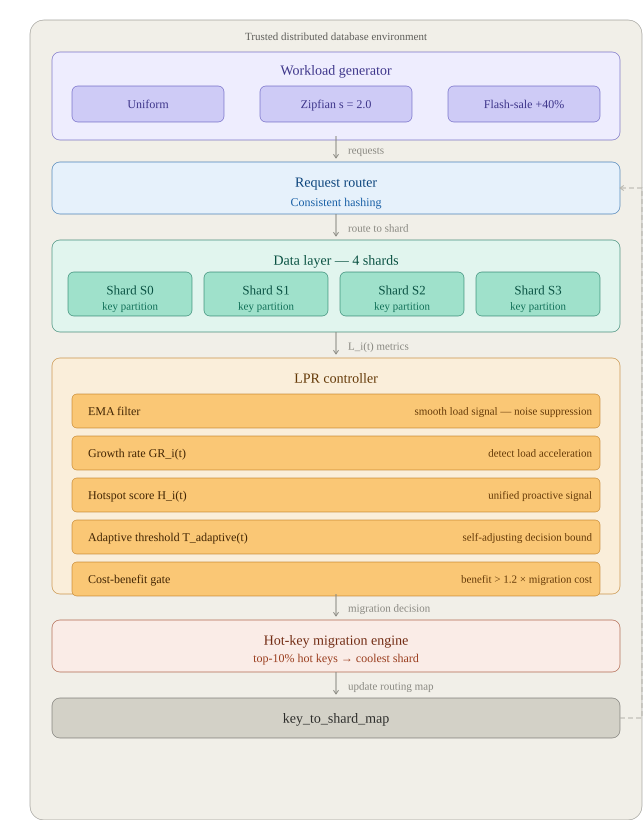

# Lightweight Proactive Re-sharding for Trusted Distributed Databases in E-commerce

**Cơ chế tái phân mảnh chủ động nhẹ cho hệ cơ sở dữ liệu phân tán trong môi trường tin cậy: Áp dụng trên dữ liệu thương mại điện tử**

---
# LPR-Ecommerce-Sharding

<p align="center">
  
</p>

<p align="center">
  <a href="#"></a>
  <a href="#"></a>
  <a href="#"></a>
  <a href="#"></a>
  <a href="#"></a>
</p>

<p align="center">
  <strong>Giảm 87% migration overhead · Tăng 30.8% throughput · Giảm 35.6% latency</strong><br/>
  <sub>So với Reactive Re-sharding trên tập dữ liệu Amazon Sale Report (128,975 giao dịch)</sub>
</p>

---

## Abstract / Tóm tắt

In distributed database systems serving e-commerce workloads, Flash Sale events generate extreme request concentration on a small subset of shards — a phenomenon known as *workload skew* following a Zipf-like distribution. Existing reactive re-sharding mechanisms suffer from high response latency and migration thrashing, while state-of-the-art adaptive systems (Marlin, PSAP) incur unnecessary Byzantine consensus overhead when deployed in trusted enterprise environments.

This work proposes **Lightweight Proactive Re-sharding (LPR)**, a heuristic mechanism that combines Exponential Moving Average (EMA) filtering with load Growth Rate analysis to forecast and preemptively migrate hot keys before hotspots form. Experiments on the Amazon Sale Report dataset (128,975 transactions) demonstrate that LPR reduces unnecessary migrations by **86–87%**, improves throughput by **30.8%**, and reduces average latency by **35.6%** compared to reactive baselines.

---

Trong các hệ thống cơ sở dữ liệu phân tán phục vụ thương mại điện tử, các sự kiện Flash Sale tạo ra hiện tượng tập trung yêu cầu cực đoan vào một nhóm nhỏ các phân mảnh — được gọi là *workload skew* theo phân phối Zipf. Các cơ chế tái phân mảnh phản ứng hiện tại gặp phải độ trễ phản ứng lớn và hiện tượng migration thrashing, trong khi các hệ thống thích ứng tiên tiến (Marlin, PSAP) tạo ra chi phí đồng thuận Byzantine thặng dư khi triển khai trong môi trường doanh nghiệp tin cậy.

Nghiên cứu này đề xuất **Lightweight Proactive Re-sharding (LPR)**, một cơ chế heuristic kết hợp bộ lọc EMA với phân tích tốc độ tăng trưởng tải để dự báo và di trú chủ động các hot key trước khi hotspot hình thành hoàn toàn.

---

## Motivation / Đặt vấn đề

### The hotspot problem in e-commerce / Bài toán hotspot trong thương mại điện tử

E-commerce workloads follow a Zipf-like distribution: the top 20% of products receive more than 80% of all access requests. On the Amazon Sale Report dataset, the measured Load Imbalance Ratio reaches **43.12** — meaning one shard absorbs 43 times the average cluster load. Under Flash Sale conditions, this skew intensifies within seconds, overwhelming any static data partition.

Khối lượng công việc thương mại điện tử tuân theo phân phối Zipf: 20% sản phẩm hàng đầu nhận hơn 80% tổng lượng yêu cầu truy cập. Trên tập dữ liệu Amazon Sale Report, chỉ số mất cân bằng tải đo được đạt **43.12** — một shard gánh gấp 43 lần tải trung bình của cụm. Trong điều kiện Flash Sale, sự lệch tải này tăng mạnh chỉ trong vài giây, làm tê liệt bất kỳ chiến lược phân mảnh tĩnh nào.

### Limitations of existing approaches / Hạn chế của các giải pháp hiện tại

| Approach | Limitation |
|---|---|
| Static Sharding | No adaptive capability; hot-spots are permanent until manual reconfiguration |
| Reactive Re-sharding | Responds only after overload occurs; causes migration thrashing under volatile loads |
| Marlin (SIGMOD 2025) | Designed for Byzantine-fault-tolerant environments; coordination overhead is excessive in trusted settings |
| PSAP (arXiv 2025) | Requires Safe-PPO reinforcement learning training; high computational cost and validator synchronization |

---

## Insight: Phát hiện hotspot *trước khi* nó xảy ra

LPR không chờ tải vượt ngưỡng — nó theo dõi **tốc độ tăng trưởng tải** và đưa ra quyết định di trú *chủ động*.

```
# Hai tín hiệu cốt lõi:
GRᵢ(t)  = (Lᵢ(t) - Lᵢ(t-1)) / (Lᵢ(t-1) + ε)   # Gia tốc tải
EMAᵢ(t) = α·Lᵢ(t) + (1-α)·EMAᵢ(t-1)            # Lọc nhiễu (α=0.3)

# Hotspot score tích hợp:
Hᵢ(t) = EMAᵢ(t) + β·GRᵢ(t)    (β = 0.5)

# Chỉ migrate khi có lợi:
Expected Benefit > 1.2 × Migration Cost
```

---

## Method / Phương pháp

### Core formulation / Công thức cốt lõi

LPR operates in discrete time cycles. At each cycle *t*, the coordinator evaluates four signals for each shard *i*:

**Load Growth Rate** — captures acceleration, not just current load:

```
GR_i(t) = ( L_i(t) - L_i(t-1) ) / ( L_i(t-1) + ε )      ε = 1e-5
```

**Exponential Moving Average** — suppresses short-term noise:

```
EMA_i(t) = α · L_i(t) + (1 - α) · EMA_i(t-1)            α = 0.3
```

**Adaptive Threshold** — self-adjusts to current system state:

```
T_adaptive(t) = mean( L_j(t) ) · γ                        γ = 1.5
```

**Hotspot Score** — unified proactive signal:

```
H_i(t) = EMA_i(t) + β · GR_i(t)                          β = 0.5
```

Migration of the top-K hottest keys from the source shard to the coolest shard is executed only when the Cost-Benefit gate is satisfied:

```
Expected Benefit > K · Migration Cost                      K = 1.2
```

### Decision pipeline / Pipeline quyết định

```
Collect L_i(t)
    → Update EMA_i(t), compute GR_i(t)
    → Compute T_adaptive(t)
    → Compute H_i(t)
    → If H_i(t) > T_adaptive(t): evaluate Cost-Benefit
        → If profitable: migrate top-10% hot keys to coolest shard
        → Update key_to_shard_map
```

---

## Experimental Setup / Thiết lập thực nghiệm

| Parameter | Value |
|---|---|
| Dataset | Amazon Sale Report (Kaggle) |
| Records after cleaning | 128,975 transactions |
| Sharding key | SKU (product identifier) |
| Number of shards | 4 |
| Simulation requests | 10,000 – 100,000 |
| Zipfian skew coefficient | s = 2.0 |
| Flash-sale burst ratio | 40% of requests to one shard |
| Platform | Apache PySpark on Google Colab |

Three workload scenarios are evaluated: **Uniform** (baseline, no skew), **Zipfian** (long-tail distribution, sustained imbalance), and **Flash-sale** (burst traffic, temporal hotspot).

---

## Results / Kết quả

### Full comparison table / Bảng so sánh tổng hợp

| Scenario | Mechanism | Throughput (req/s) | Avg Latency (µs) | Imbalance Ratio | Total Migrations |
|---|---|---|---|---|---|
| Uniform | Static | 0.91M | 1.10 | 1.20 | 0 |
| | Reactive | 0.57M | 1.74 | 1.20 | 0 |
| | **LPR** | **0.89M** | **1.12** | **1.10** | 12 |
| Zipfian | Static | 0.97M | 1.03 | 2.90 | 0 |
| | Reactive | 0.68M | 1.46 | 2.54 | 100 |
| | **LPR** | **0.89M** | **1.12** | **2.54** | **13** |
| Flash-sale | Static | 1.08M | 0.93 | 2.22 | 0 |
| | Reactive | 0.84M | 1.19 | 2.25 | 200 |
| | **LPR** | **0.85M** | **1.17** | **2.25** | **28** |

### LPR improvement over Reactive / Cải thiện của LPR so với Reactive

| Metric | Uniform | Zipfian | Flash-sale |
|---|---|---|---|
| Throughput | +56.1% | +30.8% | +1.2% |
| Average Latency | −35.6% | −23.3% | −1.7% |
| Migration Count | — | **−87%** | **−86%** |
| Monitoring Cost | −35.6% | −23.3% | −1.7% |

### Key findings / Nhận xét chính

Under Uniform workload, LPR maintains near-Static throughput (0.89M vs 0.91M req/s) while outperforming Reactive by 56.1%, confirming that the EMA and Growth Rate computations introduce negligible idle overhead. Under Zipfian workload — the most representative real-world scenario — LPR achieves the same load balance quality as Reactive (IR = 2.54) with only 13 migrations versus 100, a 87% reduction. Under Flash-sale workload, the Growth Rate signal detects the rising load slope before the hotspot fully materializes, enabling preemptive migration that limits total migrations to 28 versus 200 in the reactive case.

---

## Comparison with State-of-the-Art / So sánh với SOTA

| Criterion | LPR (this work) | PSAP (Haider et al., 2025) | Marlin (Mehta et al., SIGMOD 2025) |
|---|---|---|---|
| Target environment | Trusted enterprise DBMS | Untrusted blockchain | Untrusted blockchain |
| Prediction mechanism | EMA + Growth Rate heuristic | Safe-PPO reinforcement learning | Byzantine consensus (PBFT) |
| Algorithm complexity | O(k) per cycle | High | High |
| Model training required | No | Yes | No |
| Deterministic decisions | Fully deterministic | Requires validator sync | Partial |
| Dedicated hardware | Not required | Required | Not required |

LPR does not compete with PSAP or Marlin in their target domain. Rather, it addresses a distinct and underserved problem: lightweight adaptive sharding for trusted distributed databases where Byzantine overhead is unnecessary and operational simplicity is a hard requirement.

---

## Repository Structure / Cấu trúc dự án

```
LPR-Ecommerce-Sharding/
├── Proactive_ReSharding.ipynb      Main experiment notebook (Google Colab)
├── lpr/
│   ├── shard.py                    Shard class — load tracking and key management
│   ├── metrics.py                  EMA, Growth Rate, Hotspot Score, Adaptive Threshold
│   └── lpr_sharding.py             LPRSharding — full algorithm implementation
├── baselines/
│   ├── static_sharding.py          StaticSharding baseline
│   └── reactive_sharding.py        ReactiveSharding baseline
├── experiments/
│   ├── workload_generator.py       Uniform / Zipfian / Flash-sale workload synthesis
│   └── simulation.py               run_simulation() evaluation pipeline
├── visualization/
│   └── plot_results.py             Publication-quality plotting utilities
├── docs/
│   └── LPR_report.pdf               Full research document
└── requirements.txt
```

---

## Quickstart / Hướng dẫn chạy nhanh

### Google Colab

[](https://colab.research.google.com/github/baodangerous/LPR-Ecommerce-Sharding/blob/main/Proactive_ReSharding.ipynb)

Upload `Amazon Sale Report.csv` to `/content/drive/MyDrive/LPR_Project/datasets/` and run all cells.

### Local environment

```bash
git clone https://github.com/baodangerous/LPR-Ecommerce-Sharding.git
cd LPR-Ecommerce-Sharding
pip install -r requirements.txt
```

```python
import sys; sys.path.insert(0, '.')
from lpr.shard import Shard
from lpr.lpr_sharding import LPRSharding
from experiments.workload_generator import generate_zipfian_workload
from experiments.simulation import run_simulation

workload = generate_zipfian_workload(50000, 100, skew=2.0)
shards   = [Shard(i) for i in range(4)]
strategy = LPRSharding(num_shards=4)
result   = run_simulation(workload, strategy, shards)

print(f"Throughput : {result['total_throughput']:,.0f} req/s")
print(f"Migrations : {result['total_migrations']}")
print(f"Imbalance  : {result['final_imbalance']:.2f}")
```

---

## Hyperparameters / Tham số

| Parameter | Default | Description |
|---|---|---|
| `alpha` | 0.3 | EMA smoothing factor — controls noise suppression vs. responsiveness |
| `beta` | 0.5 | Growth Rate weight in Hotspot Score |
| `gamma` | 1.5 | Adaptive threshold safety margin |
| `migration_fraction` | 0.1 | Fraction of hot keys migrated per trigger |
| `cost_barrier` | 1.2 | Cost-benefit gate — migration requires benefit > 1.2 × cost |

---

## References / Tài liệu tham khảo

1. M. J. Amiri, "Adaptive Sharding for Scalable Blockchain Platforms," *ICDE*, 2021.
2. B. Mehta, N. Baghel, M. J. Amiri, B. T. Loo, and R. Marcus, "Marlin: Adaptive Sharding in Untrusted Environments," *SIGMOD*, 2025.
3. M. Z. Haider, T. Noreen, M. D. Assunção, and K. Zhang, "AI-driven Predictive Shard Allocation for Scalable Next-Generation Blockchains," *arXiv:2511.19450*, 2025.
4. Kaggle, "Amazon Sale Report Dataset," 2023. https://www.kaggle.com/datasets/mdsazzatsardar/amazonsalesreport

---

## Authors / Tác giả

**Nguyen Le Bao Dang** (MSSV: 23520230) and **Pham Minh Ngan** (MSSV: 23520997)  
Faculty of Information Systems, University of Information Technology — VNU-HCM  
Coursework: Big Data & Distributed Databases, 2026
